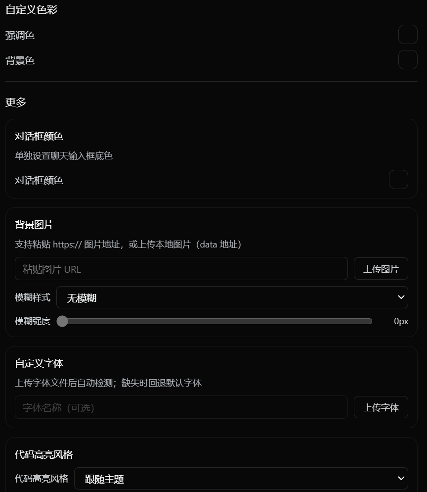
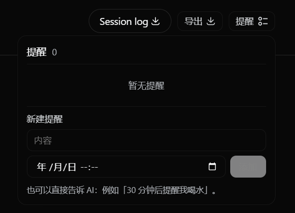

# DeepSeek Harness 桌面端

> 个人开发的 DeepSeek Harness 社区版 Windows 桌面端 · From 卧室里得 🐋

基于 [DeepSeek Harness](https://github.com/deepseek-ai/deepseek-harness)（DeepSeek 官方 Agent Harness，MIT）构建的桌面启动器：把官方网页端装进一个**无边框沉浸式窗口**，并加入语音输入、数据统计、插件市场、团队模式、会话对比等一整套桌面体验。


## ✨ 功能一览

### 🗣️ 语音输入（长按空格说话）

无需键盘打字，按住 **空格键 0.5 秒**即可开始录音，松开自动转写并发送：

- 长按空格 = 录音；轻按空格 = 正常输入空格；Esc / 轻点空格 = 取消
- 转写结果自动与先前输入的文字**拼接发送**
- 识别引擎：讯飞「录音文件转写极速版」（WebAPI，HMAC-SHA256 签名）
- 凭证仅保存在本机 `settings.yaml`，可在 设置 → 语音输入 中配置

### 📊 数据统计

侧边栏入口（数据统计），聚合全部会话的请求 / Token / 缓存 / 花费：

- 时间范围：**今天**（按小时分柱，0 点～当前小时）/ **近 7 天** / **近 30 天** / **全部**（按天分柱）
- 按范围智能加载：只看「今天」时只读取今天有活动的会话，不加载无关历史
- 柱状图：输入（浅蓝）/ 输出（深蓝）堆叠；柱高随数据、悬浮窗锚定柱顶、换柱平滑飞行
- 会话明细表按花费排序，显示每个会话的请求数 / 输入 / 输出 / 花费


### 🛒 插件市场

本地插件清单 + 在线市场双 Tab：

- **本地插件**：查看已加载的内置插件（名称 / ID / 启用状态 / 运行阶段）
- **在线市场**：GitHub Pages 插件门户，支持「在此加载」或「在浏览器打开」


### 👥 队长-成员（团队）模式

开启后由「队长」AI 自动拆分任务并派发给多名「成员」AI 并行处理，成员之间可互发消息，队长可随时终止：

- 三面板独立聊天视图（队长↔用户 / 队长↔成员 / 成员↔成员）
- 每个面板可切换对话窗口；默认成员数量与模型可在设置中配置


### 🔀 会话对比与合并

- 勾选 2～4 个会话**并排对比**（独立滚动，完整 Markdown 渲染）
- 一键**合并导出**为 Markdown 文档


### 🎨 个性化

- **自定义色彩**：HSV 调色板自由调配强调色与背景色（实时预览、恢复默认）
- **动画开关**：可整体关闭界面动画（减少动效）
- 开机自启动三态：不启动 / 启动 / 静默启动（后台驻留托盘）




### 🔔 提醒通知

对 AI 说「30 分钟后提醒我喝水」即可创建定时提醒，到期弹出 **Windows 系统通知**（QQ 同款横幅，带应用图标）；支持周期性提醒与手动删除。



### ⚙️ 更多设置

除了上述配置，还包含：知识库目录、语音输入凭证、团队配置、窗口形态（默认最大化 / 卷轴展开 / 收起曲线）等。


### 💬 会话导出

每条会话可导出 **Markdown / HTML / SVG 图片**，或一键复制 Markdown 到剪贴板。

### 🧠 本地知识库

在设置中指定本地目录后，AI 回答前会自动检索目录内的文本文件（关键词匹配，无需向量库）。

### 🗣️ 助手朗读

每条助手消息都带有「朗读」按钮，使用系统语音（zh-CN）读出回复。

### ℹ️ 关于

版本信息、字体与图标致谢，以及「本桌面端为个人开发的社区版框架，DeepSeek Harness 官方并未出版桌面端」声明。


## 📥 下载与安装

前往 **Releases** 下载最新安装包：

- **`DeepSeek.Harness.Setup.0.1.0.exe`**（约 163 MB，Windows x64；GitHub 将文件名中的空格自动转为点号，本地产物原名 `DeepSeek Harness Setup 0.1.0.exe`）

安装说明：

1. 双击安装包，可自选安装目录（默认 D 盘路径）
2. 首次启动会自动检测 Node.js：未安装或版本过旧时，会使用**随包附带的 Node.js 安装包**静默安装
3. 随后自动下载运行组件（pnpm 依赖，约几分钟），完成后即可开始对话
4. 语音输入首次使用会请求**麦克风权限**（系统弹窗）

> 安装包未做代码签名，Windows SmartScreen 可能提示「未知发布者」，选择「仍要运行」即可。

## 🛠️ 从源码构建

仓库结构：

```
DeepSeek-Harness/
├── dsh-app/              # Electron 桌面壳层（窗口 / 托盘 / 服务管理 / 语音转写 IPC）
├── harness-patches/      # 对官方 deepseek-harness 的新增与修改插件（补丁包）
├── assets/               # 截图素材
└── README.md
```

**第一步：准备官方 harness**

```bash
git clone https://github.com/deepseek-ai/deepseek-harness.git
cd deepseek-harness
pnpm install
```

**第二步：应用补丁包**

将 `harness-patches/` 下各包按 [harness-patches/README.md](harness-patches/README.md) 的说明复制到对应位置，并完成三处注册（`tsconfig.client.json` references、`packages/bundle/web-app/cordis.patch.yml` roster、`packages/bundle/web-app/package.json` dependencies）。

**第三步：构建客户端插件**

每个 client 包内执行（**必须带 client face，否则会破坏 externals**）：

```bash
tsc -b
tsdown --env.DSH_BUILD_FACE=client
```

**第四步：构建壳层与安装包**

```bash
cd dsh-app
npm install
build.bat        # 需要管理员权限（NSIS 符号链接）
```

产出 `dist/DeepSeek Harness Setup 0.1.0.exe`。

> ⚠️ `dsh-app/package.json` 的 `build.extraResources` 默认从 `C:/Users/31773/Desktop/deepseek-harness` 取 harness，构建前请改为你自己的 harness 路径，并把构建好的插件 `lib/` 同步过去。

## 📁 主要技术栈

| 部分 | 技术 |
|---|---|
| 壳层 | Electron 31（无边框窗口 / 系统原生动画 / webview 桥） |
| 网页端 | DeepSeek Harness（Cordis 插件体系 + React 客户端插件） |
| 语音识别 | 讯飞录音文件转写极速版（WebAPI） |
| 打包 | electron-builder 25 + NSIS |

## 📄 许可证

- 本仓库壳层与补丁代码：**MIT**（见 [LICENSE](LICENSE)）
- harness 部分遵循上游 [deepseek-harness](https://github.com/deepseek-ai/deepseek-harness)（MIT）
- 界面字体：OPPO Sans 3.0（OPPO，开源免费商用）

## 🙏 致谢

- [DeepSeek Harness](https://github.com/deepseek-ai/deepseek-harness) 官方团队
- 讯飞开放平台（语音转写）
- OPPO Sans 字体、[Icon-Icons](https://icon-icons.com)（齿轮图标）

---

*本桌面端为个人开发的社区版框架，DeepSeek Harness 官方并未出版桌面端。*
